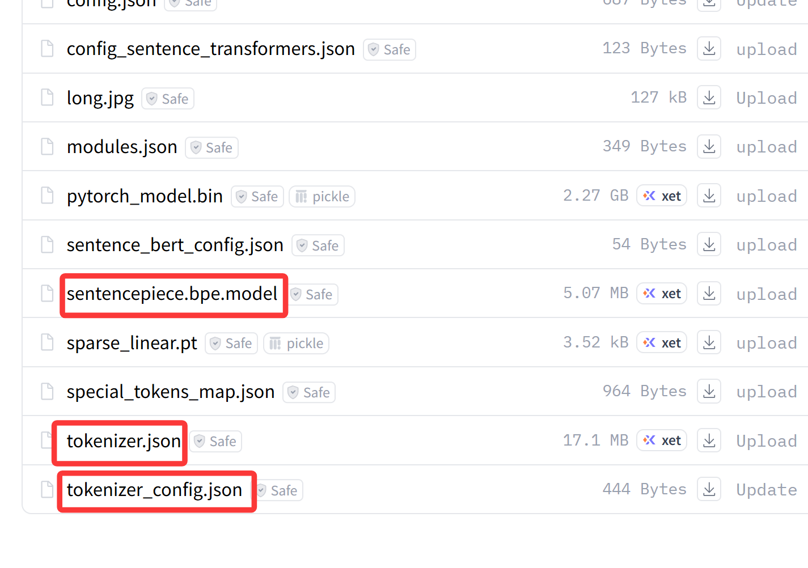

[toc]


## 文档

[Llama Hub](https://llamahub.ai/?tab=llms)

[向量存储 - LlamaIndex 框架](https://docs.llamaindex.org.cn/en/stable/module_guides/storing/vector_stores/)


## ⚠️embedding过程超出OpenAI Key速率限制

> 2025-10-27 17:17:22,232 - INFO - Retrying request to /embeddings in 7.004810 seconds 2025-10-27 17:17:30,577 - INFO - HTTP Request: POST https://api.openai.com/v1/embeddings "HTTP/1.1 429 Too Many Requests"
> 
> RateLimitError: Error code: 429 - {'error': {'message': 'You exceeded your current quota, please check your plan and billing details. For more information on this error, read the docs: https://platform.openai.com/docs/guides/error-codes/api-errors.', 'type': 'insufficient_quota', 'param': None, 'code': 'insufficient_quota'}}


## 使用BGE模型在本地embedding

[BAAI/bge-m3 · Hugging Face](https://huggingface.co/BAAI/bge-m3)


使用 `hf download`，访问的是 **镜像 `https://hf-mirror.com`**

设置Hugging Face Token

访问：https://huggingface.co/settings/tokens

生成 **Read access token**

```
export HUGGINGFACE_HUB_TOKEN="你的token"
huggingface-cli download BAAI/bge-m3 --local-dir ./model/bge-m3
# 或者hf download BAAI/bge-m3 --local-dir ./model/bge-m3
```

手动下载到本地./model/bge-m3




## llamaindex & GLM集成

❌

```python
Settings.llm = ChatOpenAI(
    model="glm-4",
    temperature=0.7,
    openai_api_key="@@@",
    openai_api_base="https://open.bigmodel.cn/api/paas/v4/",
    max_tokens=2000,  # 最大输出 token 数
)
```

类型不匹配

`Settings.llm` 必须是继承自 `llama_index.llms.base.LLM` 的对象

LlamaIndex 自带的 `OpenAI` 类是继承自 `llama_index.llms.base.LLM` 的，因此可以直接赋值给 `Settings.llm`

```python
from llama_index.llms.openai import OpenAI

Settings.llm = OpenAI(
    model="glm-4.6",
    temperature=0.7,
    openai_api_key="@@@",
    openai_api_base="https://open.bigmoel.cn/api/paas/v4/",
    max_tokens=2000,
)
```

> ValueError: Unknown model 'glm-4.6'. Please provide a valid OpenAI model name in: o1, o1-2024-12-17, o1-pro, o1-pro-2025-03-19, o1-preview, o1-preview-2024-09-12, o1-mini, o1-mini-2024-09-12, o3-mini, o3-mini-2025-01-31, o3, o3-2025-04-16, o3-pro, o3-pro-2025-06-10, o4-mini, o4-mini-2025-04-16, gpt-5, gpt-5-2025-08-07, gpt-5-mini, gpt-5-mini-2025-08-07, gpt-5-nano, gpt-5-nano-2025-08-07, gpt-5-chat-latest, gpt-5-pro, gpt-5-pro-2025-10-06, gpt-4, gpt-4-32k, gpt-4-1106-preview, gpt-4-0125-preview, gpt-4-turbo-preview, gpt-4-vision-preview, gpt-4-1106-vision-preview, gpt-4-turbo-2024-04-09, gpt-4-turbo, gpt-4o, gpt-4o-audio-preview, gpt-4o-audio-preview-2024-12-17, gpt-4o-audio-preview-2024-10-01, gpt-4o-mini-audio-preview, gpt-4o-mini-audio-preview-2024-12-17, gpt-4o-2024-05-13, gpt-4o-2024-08-06, gpt-4o-2024-11-20, gpt-4.5-preview, gpt-4.5-preview-2025-02-27, chatgpt-4o-latest, gpt-4o-mini, gpt-4o-mini-2024-07-18, gpt-4-0613, gpt-4-32k-0613, gpt-4-0314, gpt-4-32k-0314, gpt-4.1, gpt-4.1-mini, gpt-4.1-nano, gpt-4.1-2025-04-14, gpt-4.1-mini-2025-04-14, gpt-4.1-nano-2025-04-14, gpt-3.5-turbo, gpt-3.5-turbo-16k, gpt-3.5-turbo-0125, gpt-3.5-turbo-1106, gpt-3.5-turbo-0613, gpt-3.5-turbo-16k-0613, gpt-3.5-turbo-0301, text-davinci-003, text-davinci-002, gpt-3.5-turbo-instruct, text-ada-001, text-babbage-001, text-curie-001, ada, babbage, curie, davinci, gpt-35-turbo-16k, gpt-35-turbo, gpt-35-turbo-0125, gpt-35-turbo-1106, gpt-35-turbo-0613, gpt-35-turbo-16k-0613


1. 用gpt模型 （超时，需要解决服务器代理问题，暂且放弃 ）


2. llamaindex有GLM集成

[Llama Hub](https://llamahub.ai/?tab=llms)

🌠[LlamaIndex Llms 集成：智普 AI --- LlamaIndex Llms Integration: ZhipuAI](https://llamahub.ai/l/llms/llama-index-llms-zhipuai?from=llms)

```python
%pip install llama-index-llms-zhipuai
```


（3. 或者把glm-4.6包装成 LlamaIndex 能接受的对象（CustomLLM））

